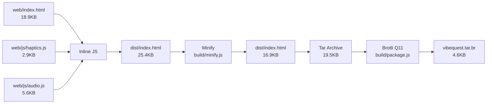

# PulseQuest - Axon Submission

**Haptics-first maze navigation game for the Axon by AppLovin prize track at TartanHacks 2026**

## ✅ Requirements Met

- ✅ **Compressed archive < 15KB**: `pulsequest.tar.br` is **4,639 bytes** (30.2% of limit)
- ✅ **Fully playable and self-contained**: Single HTML file, no external dependencies
- ✅ **No runtime network requests**: All assets inline, zero external calls
- ✅ **Offline-only**: No fetch(), XMLHttpRequest, or WebSocket usage
- ✅ **Blindfold playable**: Distinct vibration patterns via `navigator.vibrate` on Android

## 🎮 Game Overview

Navigate a boat through dense fog to find a hidden beacon using:
- **Limited vision**: 2-unit radius visibility
- **Sonar scanning**: Reveals tiles ahead, left, and right
- **Haptic feedback**: Unique vibration patterns for each tile type
- **Audio cues**: Procedural sound effects (Web Audio API)

## 🔨 Build Instructions

### Prerequisites
- Node.js (for minification)
- tar (built-in on Mac/Linux, Git Bash on Windows)

### Build Steps

```bash
# 1. Create minified single-file build
npm run build

# 2. Create compressed submission artifact
npm run package
```

This produces:
- `dist/index.html` - Minified single file (~16.9KB)
- `pulsequest.tar.br` - Compressed submission (~4.6KB)

### Build Output
```
✓ Minified: 16,910 bytes (33.3% smaller)
✓ Archive:  4,639 bytes (30.2% of 15KB limit) - Now PulseQuest!
```

## 🧪 Local Testing

### Test in Browser
```bash
npm run test:local
# Opens http://localhost:8000
```

### Verification Checklist
1. Open DevTools → Network tab
2. Reload page
3. Verify only `index.html` loads (no external requests)
4. Disable Wi-Fi/network
5. Reload page → game still works
6. Test all features: move, turn, scan, recap, win

## 📱 Android Deployment (Termux)

### Setup Termux
1. Install **Termux** from F-Droid (NOT Google Play)
2. Open Termux and run:

```bash
pkg update && pkg upgrade
pkg install python tar brotli
termux-setup-storage
```

### Deploy Game
```bash
# Copy pulsequest.tar.br to Downloads folder on phone
cd ~/storage/downloads

# Extract archive
brotli -d pulsequest.tar.br
mkdir pulsequest && tar -xf pulsequest.tar -C pulsequest

# Start server
cd pulsequest
python -m http.server 8000
```

### Access Game
1. Open Chrome on Android
2. Navigate to: `http://127.0.0.1:8000`
3. **Add to Home Screen** for offline play
4. Grant any permissions if prompted

## 🎯 Blindfold Play Instructions

### Training Mode
1. Open game in Android Chrome
2. Toggle **Training** mode
3. Test each vibration pattern:
   - **🌊 Empty**: Single short tap (25ms)
   - **🧱 Wall**: Triple knock pattern (20-30-20-30-20ms)
   - **🪨 Hazard**: Long warning buzz (180ms)
   - **🗼 Beacon**: Double pulse (25-80-25-80-25ms)
   - **📡 Scan**: Quick tick + sequence

### Blindfold Navigation
1. Memorize the vibration patterns
2. Start **Tutorial** level
3. Close eyes or turn off screen
4. Navigate using haptic feedback only:
   - **W** = Move forward
   - **A/D** = Turn left/right
   - **S** = Scan (feel ahead, left, right)
   - **R** = Recap (current tile + last scan)

### Gameplay Tips
- Use **Scan** liberally to map surroundings
- **Recap** reminds you of last scan results
- Wall collision = triple knock + error buzz
- Hazard = long buzz + stress counter
- 3 hazards = reset to start

## 🎵 Haptic Alphabet

| Tile/Event | Pattern | Duration | Feel |
|------------|---------|----------|------|
| Empty (E) | `[25]` | 25ms | Quick tap |
| Wall (W) | `[20,30,20,30,20]` | 140ms | Triple knock |
| Hazard (H) | `[180]` | 180ms | Long warning |
| Beacon (B) | `[25,80,25,80,25]` | 240ms | Double pulse |
| Separator | `[15]` | 15ms | Tiny tick |
| OK | `[15]` | 15ms | Confirmation |
| Error | `[40,30,40]` | 110ms | Double thud |
| Reset | `[250,60,20,30,20]` | 380ms | Heavy + triple |
| Win | `[25,40,25,40,120]` | 250ms | Rising celebration |

## 📊 Technical Details

### File Sizes
| Asset | Uncompressed | Compressed | Notes |
|-------|--------------|------------|-------|
| dist/index.html | 16,910 bytes | - | Minified single file |
| vibequest.tar | 19,456 bytes | - | Tar archive |
| vibequest.tar.br | - | **4,639 bytes** | **Final submission** |

### Compression Ratio
- Uncompressed → Minified: 33.3% reduction
- Minified → Brotli: 72.6% reduction
- Overall: **81.7% compression** (25.4KB → 4.6KB)

### Browser Compatibility
- **Desktop**: Chrome, Firefox, Safari, Edge (all modern browsers)
- **Android**: Chrome, Firefox (navigator.vibrate supported)
- **iOS**: Safari (audio-based haptics fallback)

### Technologies
- **100% vanilla**: No frameworks, no libraries
- **Procedural audio**: All sounds synthesized via Web Audio API
- **CSS animations**: No canvas, no images
- **Haptic API**: `navigator.vibrate` with audio fallback

## 🔧 Development Scripts

| Command | Description |
|---------|-------------|
| `npm run build` | Minify dist/index.html |
| `npm run package` | Create vibequest.tar.br (Node.js) |
| `npm run package:bash` | Create archive (requires brotli CLI) |
| `npm run test:local` | Serve dist/ on port 8000 |

## 🎮 Controls

| Action | Key | Button | Haptic |
|--------|-----|--------|--------|
| Move Forward | W / ↑ | ⛵ Move | Tile-specific |
| Turn Left | A / ← | ◀ | Quick tick |
| Turn Right | D / → | ▶ | Quick tick |
| Scan | S / Shift | ◎ Scan | Sequence |
| Recap | R | ↻ Recap | Previous scan |
| Start/Restart | Enter | Tap overlay | - |

## 🏗️ Build Pipeline



## 📦 Submission Validation

Run validation script from Axon PDF:
```bash
# Extract and serve
brotli -d pulsequest.tar.br
mkdir extracted
tar -xf pulsequest.tar -C extracted
cd extracted
python3 -m http.server 8000

# Open http://localhost:8000
# Verify gameplay works
```

## 🚀 Future Enhancements (Not in Axon Build)

- WebSocket connection to ESP32 hardware controller
- Procedurally generated maze levels
- Multiplayer race mode
- Level editor
- Accessibility screen reader mode

---

**Built for TartanHacks 2026**  
Axon by AppLovin Prize Track  
Branch: `axon-build`
